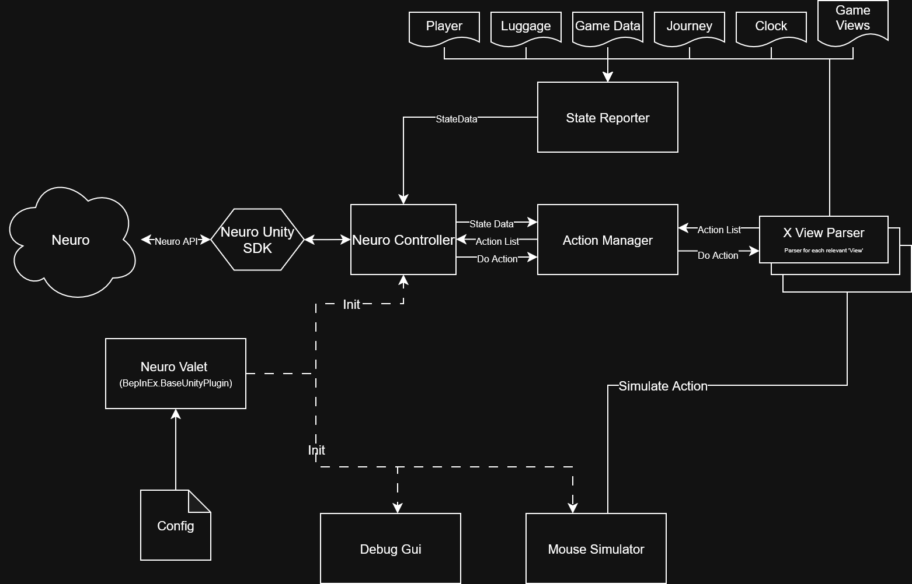

# NeuroValet
### Neuro-sama integration for 80 Days, allowing Neuro and Evil to do all the hard work for yet another British guy

This is a BepInEx plugin, and uses the [Neuro game SDK](https://github.com/VedalAI/neuro-game-sdk/tree/main) to integrate with Neuro to let her play the game.

## Design 

### Main Sections:
* **State Reporter**: Gathers and compiles various state data that help provide context for Neuro and for the View Parsers.
* **Action Manager**: Determines which actions are currently available, by determining which views are visible at the moment, and asking each one what it can do depending on a set order of priority.

### Other Sections:
* **Neuro Valet**: Plugin's main file. Serves as the interface between the SDK and the State&Action data, and manages the flow of the plugin.
* **View Parser**: 
The game runs most of its actions through it's UI, in what it calls 'Views'. Each view is a section in the GUI that shows or hides according to current game state (such as Story view for main story dialogue, Cloud View for actions on the map or within the City and so on). 
Each parser is responsible for understanding its corresponding view, creating relevant context and determining which actions are available. Some parsers also run the actions themselves if they aren't trivial to run.
* **Mouse Simulator**:
The game is very GUI-focused, and so to fully implement item handling properly, and to have them move in a visible way to the viewer, we override mouse position for these actions. This requires going through UI events.
Note this does not move the real mouse cursor, only where unity's Input system reports the mouse position, but it does block ingame actions by the mouse when active.
* **Clock Overrides (not in diagram)**
Small submodule handling overriding the ingame default clock timers, which allows the mod to make the timers run slower and give Neuro more time to react

## Debug Help
There are a couple of shortcuts to show debug information:

* *F1* - Toggle Debug GUI, which shows state information and which actions are available.

* *F2* - Toggle Debug Cursor, which shows current simulated mouse position.

* *F3* - Toggle 'OverrideMouse' - when dragging items, Neuro controls the mouse. She should release control when she releases them, but this toggle along with the Debug Cursor might be helpful for debugging if something goes wrong.