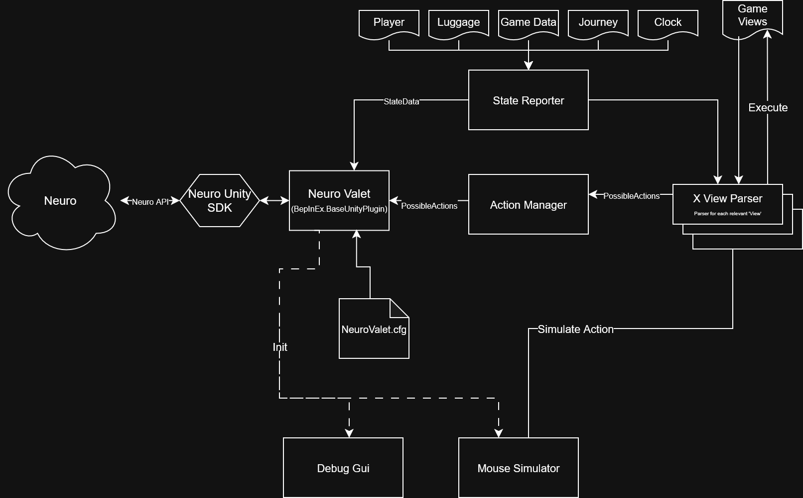

# NeuroValet
### Neuro-sama integration for 80 Days, allowing Neuro and Evil to do all the work for yet another British guy

This is a BepInEx plugin, and uses the [Neuro game SDK](https://github.com/VedalAI/neuro-game-sdk/tree/main) to integrate with Neuro to let her play the game.

## Design 

### Main Sections:
* **State Reporter**: Gathers and compiles various state data to provide context for Neuro.
* **Action Manager**: Determines which actions are currently available, by determining which views are visible at the moment, and asking each one what it can do in order of priority.

### Other Sections:
* **Neuro Valet**: Plugin's main file. Serves as the interface between the SDK and the State&Action data, and manages the flow of the plugin.
* **View Parser**: 
The game runs most of its actions through it's UI, in what it calls 'Views'. Each view is a section in the GUI that shows or hides according to current game state (such as Converse view for dialogue, Cloud View for actions within the City and so on). Each parser is responsible for understanding its view, which actions are available, and running the actions.
* **Mouse Simulator**: *(Not in use yet)* 
The game is very GUI-focused, and to fully do some actions, such as dragging and dropping an item from the market to a suitcase, requires going through UI events.
Note this does not move the real mouse cursor, only where unity's Input system thinks the mouse position at. It does block actions by the mouse when active.

## Debug Help
There are a couple of shortcuts to show debug information:

* *F1* - Toggle Debug GUI, which shows state information and which actions are available.

* *F2* - Toggle Debug Cursor, which shows current simulated mouse position.
